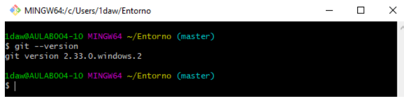

# ENTORNOS DE DESARROLLO

### UT1.-Elementos de desarrollo de sofware

1. Desarrollo de sofware
-  i. Modelo cascada
- ii. Modelos evolutivos
2. Metologias agiles

### UT2.- Instalacion y uso de entornos de desarrollo

- IntelliJ IDEA  
- Eclipse  
- NetBeans  

### UT3.- Sistemas de control de versiones

<code>git --version</code>

Todo esta en el aula virtual
